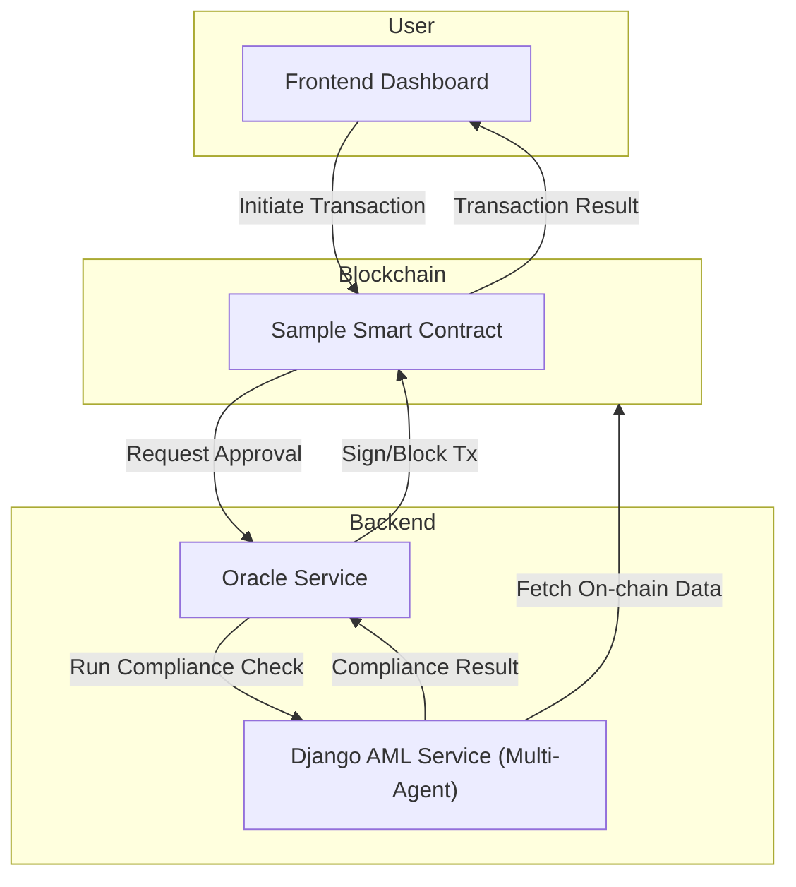
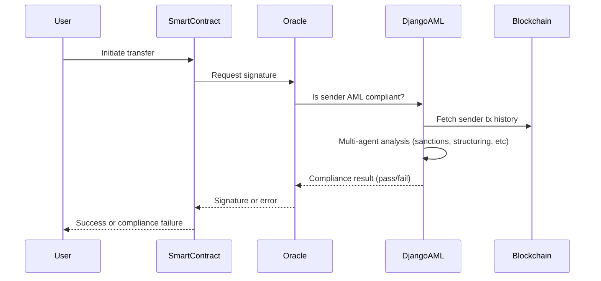
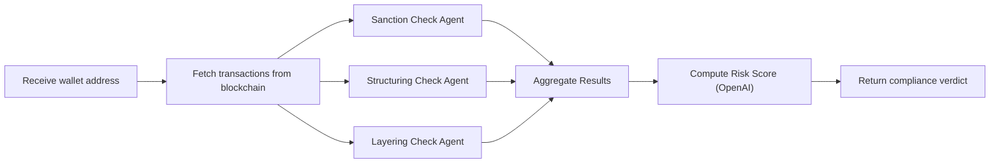
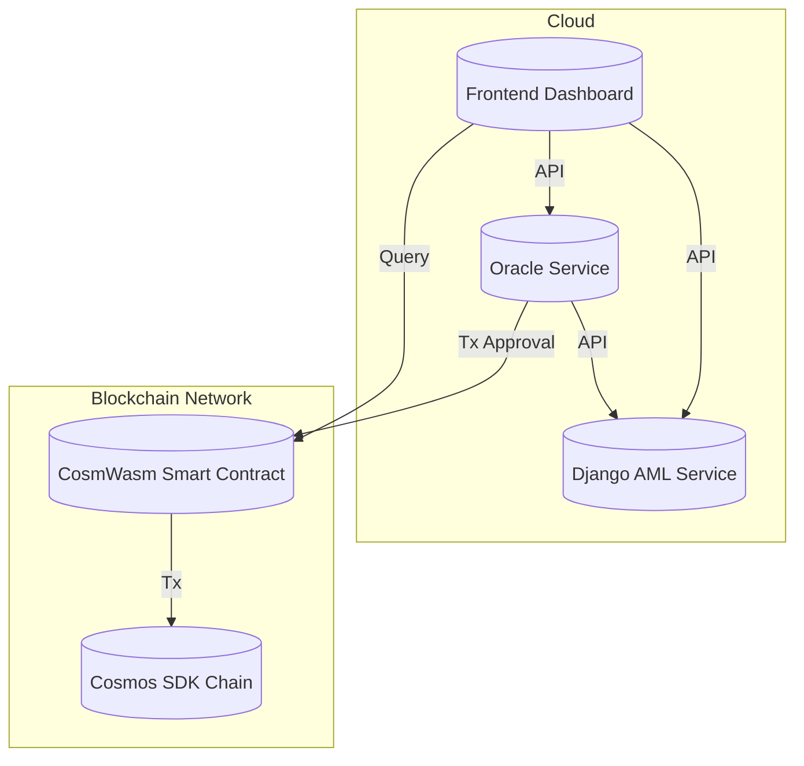

# 🏗️ Solution Architecture: AML Smart Contract Checks for Non-Custodial Wallets

## Overview

This document describes the architecture and design of the AI-powered oracle and anti-money laundering (AML) compliance system for blockchain custodial wallets. The system ensures that custodial wallets only accept transactions from compliant non-custodial wallets, leveraging a multi-agent AML checker, an oracle service, and a smart contract on a Cosmos SDK chain.

---

## High-Level Architecture

---

## Component Breakdown

### 1. Frontend Dashboard (Next.js/React)

- Allows users/admins to initiate transactions and view compliance status.
- Visualizes transaction networks and compliance results.

### 2. Smart Contract (CosmWasm, Rust)

- Implements custodial wallet logic.
- Requires oracle signature for sensitive operations (e.g., `receive_with_approval`).
- Rejects transactions from non-compliant wallets.

### 3. Oracle Service (Node.js/TypeScript)

- Listens for signature requests from the smart contract.
- Calls the Django AML service to check sender compliance.
- Signs or blocks transactions based on compliance verdict.

### 4. Django AML Service (Python, LangGraph, OpenAI)

- Multi-agent system for layered AML checks (sanctions, structuring, layering, etc.).
- Fetches live on-chain data for analysis.
- Aggregates agent results and computes risk score.

---

## Signature Generation & Compliance Flow

---

## Multi-Agent AML Analysis (Django Service)

---

## Data Flow Summary

1. User initiates a transaction via the dashboard.
2. Smart contract requests oracle signature for the transaction.
3. Oracle service queries the Django AML backend for compliance.
4. Django service fetches on-chain data and runs multi-agent analysis.
5. Oracle receives compliance verdict and signs or blocks the transaction.
6. Smart contract executes or rejects the transaction based on oracle response.
7. Dashboard updates with transaction and compliance status.

---

## Deployment Diagram

---

## Key Design Decisions

- **Oracle as Compliance Gatekeeper**: The oracle is the only entity that can approve sensitive smart contract operations, ensuring all transactions are AML-checked.
- **Multi-Agent AML Analysis**: Using LangGraph and OpenAI enables flexible, extensible compliance logic.
- **Separation of Concerns**: Each component (frontend, oracle, AML backend, contract) is independently deployable and testable.
- **Live Data Integration**: The Django service fetches real-time blockchain data for accurate compliance checks.

---

## Extensibility & Future Work

- Add more compliance agents (e.g., behavioral, anomaly detection).
- Integrate additional data sources (e.g., Google datasets, external sanctions lists).
- Support more blockchains and contract types.
- Enhance dashboard analytics and alerting.

---

## Architecture Diagram (Image)

If required, export the above mermaid diagrams to PNG/JPEG for presentations or documentation.
