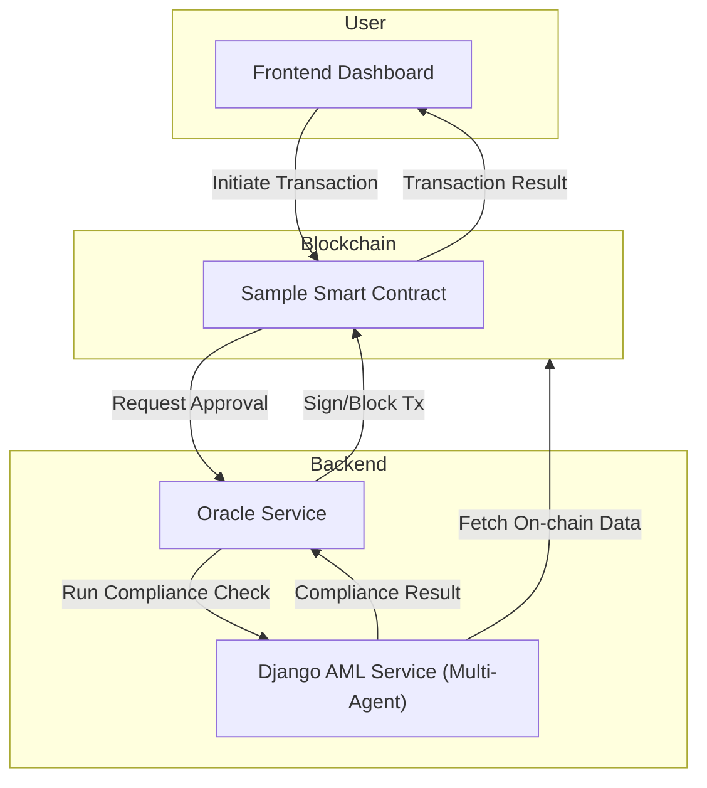
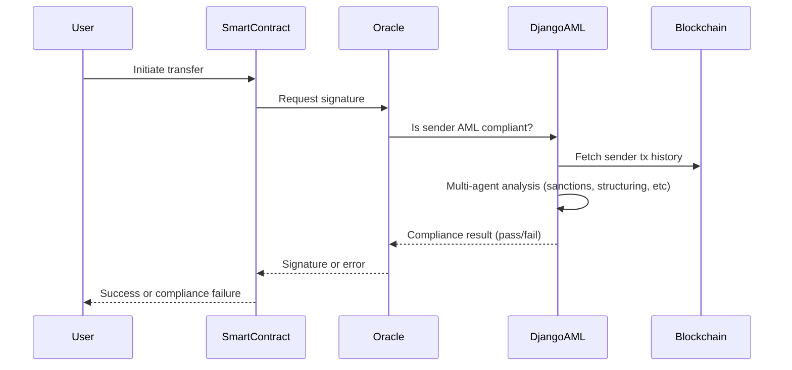
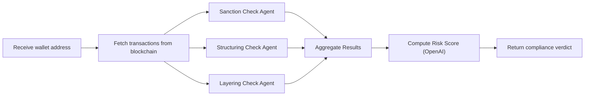

# 🚀 Project Name: AI Orchestration for Email & Document Triage Routing🌟

## Description

This project implements an AI-powered oracle and anti-money laundering (AML) compliance system for blockchain custodial wallets. The system enables smart contracts associated with custodial wallets to perform only approved transactions, ensuring that any non-custodial wallet suspected of money laundering cannot transact with custodial wallets. The architecture leverages a multi-agent AML checker using LangGraph and OpenAI, a Django service for on-chain data analysis, and an oracle service that signs or blocks transactions based on compliance checks.

## 📌 Table of Contents

- [Introduction](#introduction)
- [Demo](#demo)
- [Inspiration](#inspiration)
- [What It Does](#what-it-does)
- [How We Built It](#how-we-built-it)
- [Challenges We Faced](#challenges-we-faced)
- [How to Run](#how-to-run)
- [Tech Stack](#tech-stack)
- [Team](#team)

---

## 🎯 Introduction

### AML Smart Contract checks for Non-Custodial Wallets using Oracle & Google datasets

This project demonstrates a secure, AI-driven compliance architecture for blockchain custodial wallets. It consists of:

- **Sample Smart Contract**: A CosmWasm contract that interacts with the oracle for transaction approval.
- **Django Service**: Implements a multi-agent AML checker using LangGraph and OpenAI, fetching live on-chain data and performing compliance analysis.
- **Oracle Service**: Signs transactions for the smart contract using its private key, but only if the involved wallets pass AML checks. If a wallet is non-compliant, the oracle blocks the transaction.

The system ensures that custodial wallets are protected from receiving funds from wallets flagged for money laundering or other compliance risks.

## 🎥 Demo

🔗 [Live Demo](#) (if applicable)  
📹 [Video Demo](#) (if applicable)  
🖼️ Screenshots:
[Screenshot 1](link-to-image)

---

Here are some screenshots of the application:

1. **Dashboard**:
   

2. **Compliance Failure UI**:
   

3. **Transaction Network Graph**:
   

## 💡 Inspiration

This project was created during the [Technology Hackathon 2025] to showcase how AI-driven compliance and blockchain oracles can improve the security and regulatory compliance of custodial wallets and smart contracts.

## ⚙️ What It Does

### Features

- **On-chain AML Compliance**: All transactions to custodial wallets are checked for AML compliance using a multi-agent system.
- **Oracle-based Transaction Approval**: The oracle service signs transactions only if the AML check passes, otherwise blocks the transaction.
- **Smart Contract Integration**: The sample contract requires oracle approval for sensitive operations.
- **Live Blockchain Data Analysis**: The Django service fetches and analyzes live blockchain data for compliance checks.
- **Multi-Agent Architecture**: The Django service uses LangGraph and OpenAI agents to perform layered compliance analysis (sanctions, structuring, layering, etc.).
- **Interactive Dashboard**: Visualizes transaction networks and compliance status.

## 🛠️ How We Built It

### Architecture Overview



### Signature Generation & Checking Flow



### Multi-Agent AML Analysis (Django Service)



### Environment Variables

Create a `.env` file in each service root as needed. Example for Django:

```
OPENAI_API_KEY=your_openai_key
ORACLE_API_URL=http://localhost:8080
```

### How to Run

1. **Clone the Repository**:
   ```bash
   git clone <repo-url>
   cd wf-hack-test
   ```
2. **Set Up Local Cosmos SDK Blockchain (Docker)**:
   ```bash
   chmod +x start.sh
   ./start.sh
   ```
   This will set up and start a local Cosmos SDK blockchain using Docker.
3. **Set Up Python Backend (Django AML Service)**:
   ```bash
   cd code/src/django_service
   python3 -m venv venv
   source venv/bin/activate
   pip install -r requirements.txt
   uvicorn django_service.asgi:application --host 0.0.0.0 --port 8000 --workers 4
   ```
4. **Set Up Oracle Service**:
   ```bash
   cd ../oracle-service
   npm install
   npm run dev
   ```
5. **Deploy/Instantiate Smart Contract**:
   (See contract folder for instructions)

6. **Access the Dashboard**:
   ```bash
   cd ../aml-oracle-dashboard
   pnpm i
   pnpm run dev
   ```

---

## Usage

1. **Initiate a Transaction**: User initiates a transfer from a non-custodial wallet to a custodial wallet via the smart contract UI.
2. **Oracle Approval**: The smart contract requests a signature from the oracle service.
3. **AML Compliance Check**: The oracle calls the Django AML service, which runs multi-agent analysis on the sender wallet using live blockchain data.
4. **Transaction Decision**: If the sender passes compliance, the oracle signs the transaction; otherwise, it is blocked and the user is notified.
5. **Dashboard**: Users and admins can view transaction network graphs and compliance status in the dashboard.

## 🚧 Challenges We Faced

- **Newness to Rust**: Our team had limited prior experience with Rust, which made developing and debugging the CosmWasm smart contract a significant learning curve.
- **Integration of Oracle Logic**: Integrating the oracle service with both the smart contract and the Django AML backend required careful design to ensure secure and reliable communication.
- **Designing the receive_with_approval Architecture**: Architecting the `receive_with_approval` flow in the smart contract to require oracle approval for sensitive transactions was challenging and required several iterations to get right.
- **Multi-Agent Orchestration**: Coordinating multiple AI agents for layered AML checks using LangGraph and OpenAI introduced complexity in both logic and error handling.
- **Integrating live blockchain data fetching and analysis in real time**: Ensuring that the Django service could fetch and analyze on-chain data quickly and reliably was a key technical challenge.
- **Designing a robust multi-agent AML checker using LangGraph and OpenAI**: Building a system that could flexibly combine different compliance checks and aggregate their results required careful orchestration.
- **Ensuring secure and reliable oracle signing for smart contract transactions**: The oracle's signing logic had to be both secure and robust against edge cases and failures.
- **Handling edge cases for compliance failures and user feedback**: Providing clear feedback to users and handling all possible compliance failure scenarios was essential for a good user experience.

## 🏃 How to Run

See the [How We Built It](#how-we-built-it) section above for setup and run instructions for each service.

## 🏗️ Tech Stack

- 🔹 Frontend: Next.js, React, Tailwind CSS
- 🔹 Backend: Django (ASGI, Uvicorn), Node.js (Express)
- 🔹 Smart Contract: CosmWasm (Rust)
- 🔹 Oracle: Node.js, TypeScript
- 🔹 AI/Agents: LangGraph, OpenAI API
- 🔹 Blockchain: Cosmos SDK chain

## 👥 Team

- **Utkarsh** _(Program Associate)_ - [GitHub](https://github.com/Utkarsh575) | [LinkedIn](https://www.linkedin.com/in/utkarsh575)
- **Anvit Pawar** _(Program Associate)_ - [GitHub](https://github.com/anvitpawar) | [LinkedIn](https://www.linkedin.com/in/anvit-pawar-b7602aba)
- **Aniket Saxena** _(Program Associate)_ - [GitHub](https://github.com/aniket3012) | [LinkedIn](https://www.linkedin.com/in/aniket-saxena-61333221a/)
- **Yash Solani** _(Program Associate)_ - [GitHub](https://github.com/Yash-Dev-Solanki) | [LinkedIn](https://www.linkedin.com/in/yash-solanki-8a73a022a/)
